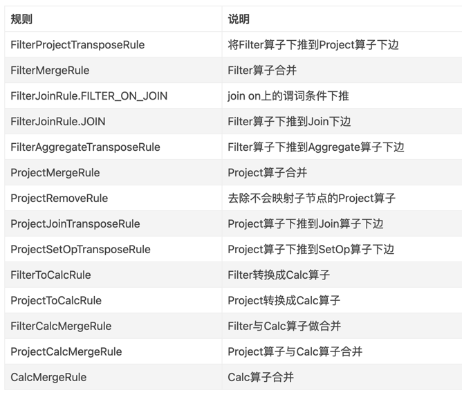

# calcite-demo

calcite的相关练习代码，包含CSV适配器，使用CSV适配器来进行SQL查询。SQL的parse和validate，以及RBO和CBO的使用。

# 项目结构

- pers.shezm.calcite
-
    - csv : csv适配器相关内容
-
    - optimizer : 优化器相关内容，包含自定义的 RelNode，Converter，以及Cost计算相关内容
-
  - test : 主要演示的地方，包含各种代码演示
-
  - utils : 工具类

# 优化规则

# 关联博客

### calcite 基础

[Calcite 参与对象简介](https://zhuanlan.zhihu.com/p/56180392)

[Calcite 概念](https://www.cnblogs.com/nightbreeze/p/14486935.html)

### 优化器

[Calcite Volcano Planner
](https://aaaaaaron.github.io/2020/02/09/Calcite-Volcano-Planner/)

[calcite 物化视图](https://www.jianshu.com/p/effefb55017c)

[深入浅出Calcite与SQL CBO（Cost-Based Optimizer）优化](https://zhuanlan.zhihu.com/p/248796415)

[Hive使用Calcite CBO优化流程及SQL优化实战](https://zhuanlan.zhihu.com/p/258081600)
